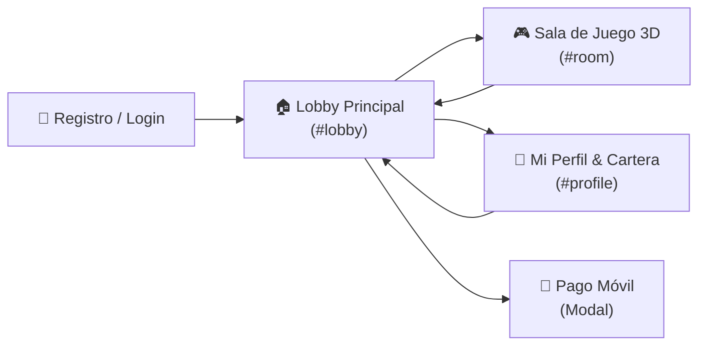

# 🧠 CEREBRO BINGOPRO ROYAL — Documentación Maestra & Memoria de Sistema

Este archivo contiene el **Cerebro Operativo** completo de **BingoPro Royal**, sirviendo como guía de conocimiento, reglas de negocio, arquitectura de código y referencia para desarrolladores e inteligencia artificial.

---

## 📌 1. Visión General del Proyecto

BingoPro Royal es una plataforma profesional de Bingo online en tiempo real, 100% automatizada a través de WhatsApp y acompañada de un **Sistema Web Multi-Pantalla estilo Casino Las Vegas / Apuestas Royal (SPA)** y un **Panel de Administración Web** con contabilidad financiera de doble entrada (*Double-Entry Ledger*).

### 💰 Parámetros Económicos (Reglas Activas)
- **Precio por Cartón (Sala Clásica):** `100.00 Bs`
- **Comisión de la Casa (Rake):** `15%`
- **Premio 1 Línea Horizontal:** `10%` del pote total
- **Premio 2 Líneas Horizontales:** `15%` del pote total
- **Premio Bingo Completo:** `60%` del pote total
- **Límite de Cartones:** Hasta `50` cartones por jugador por ronda
- **Intervalo entre Partidas:** Cada `5 minutos` (Automatizado en segundo plano)
- **Ventana de Ventas:** `60 segundos`
- **Mínimo de Jugadores:** `2` para iniciar partida (si no se cumple, se reembolsa automáticamente)
- **Método de Recarga:** Pago Móvil (aprobación atómica en 1 clic desde el Panel Admin)

---

## 🔑 2. Credenciales y Enlaces de Acceso Local

- **Servidor Web Principal:** `http://localhost:3000`
- **Panel Administrativo:** `http://localhost:3000`
  - **Usuario:** `admin`
  - **Contraseña:** `Heatox.227`
- **Plataforma Web Jugador (Casino Royal SPA):** `http://localhost:3000/player.html`
- **Vinculador de WhatsApp (QR Code):** `http://localhost:3000/qr.html`
- **Repositorio GitHub Oficial:** `https://github.com/HeatoX/bingopro-whatsapp`

---

## 🎰 3. Plataforma Web del Jugador — Casino Royal SPA (player.html)

El portal del jugador está diseñado como una **Single Page Application (SPA)** de nivel casino internacional con navegación fluida entre 4 secciones principales:

### 🌟 Secciones y Características de Última Generación:

1. **🔑 Registro / Login:** Formulario estilo cristal (*Glassmorphism*) con número de WhatsApp y nombre.
2. **🏠 Lobby Principal (Estilo Apuestas Royal):**
   - **Píldora Verde Neón de Balance:** En la barra superior mostrando avatar, nombre y saldo actual (`Bienvenido, Juan / Balance: Bs 100.00`).
   - **Banners Héroe Promocionales:** *Viernes de Fortuna* (Jackpot de Bs 436,870.00) y *La Última Bola de la Semana* (Jackpot de Bs 4,339,037.19).
   - **Reloj de Cuenta Regresiva desde Afuera:** Temporizador fluorescente en vivo en la tarjeta de sala mostrando cuándo abre ventas o empieza la partida (`PRÓXIMO JUEGO: 00:45`).
   - **Salas de Bingo:** Bronce (50 Bs), Clásica En Vivo 🔴 (100 Bs), VIP Gold (250 Bs) y Diamante (500 Bs).
3. **👤 Mi Perfil & Cartera:**
   - Avatar personalizado con iniciales.
   - Saldo disponible en Bs con animación de contador.
   - Botón de Recargar Pago Móvil.
4. **🎮 Sala de Juego en Vivo (Arena 3D):**
   - **⚡ Ordenamiento Automático Dinámico (Best Cards First):** Los cartones que más números han pegado (más cercanos a ganar o en `🔥 ¡FALTA 1!`) se posicionan de **PRIMEROS** arriba en la parrilla automáticamente.
   - **👑 Cartel Gigante Flotante de ¡BINGO! con Nombre del Ganador:** Al cantar victoria, aparece un banner pantalla completa anunciando al jugador ganador y su premio exacto en Bs con confeti animado.
   - **🔄 Limpieza Automática de Cartones:** Al finalizar la ronda o iniciar una nueva partida, los cartones viejos se limpian automáticamente para permitir comprar los de la nueva ronda.
   - **⏱️ Reloj de Cuenta Regresiva en la Sala:** Temporizador en vivo sobre el bombo que muestra el tiempo restante de ventas o el progreso de bolillas cantadas (`12/75 EN VIVO`).
   - **🛒 Píldoras de Selección de Cartones:** Botones para comprar `1`, `2`, `🔥 6 (Paga 4)`, `12`, `24`, `48` cartones en 1 clic.
   - **🎰 Bombo Mecánico 3D con Física:** Jaula giratoria transparente con 18 bolillas numeradas rebotando en 3D con gravedad.
   - **🗣️ Cantador de Voz en Español (`speechSynthesis`).**
   - **💬 Sala de Chat en Vivo.**

---

## 🔐 4. Sistema Financiero (Double-Entry Ledger)

Para prevenir cualquier descuadre financiero o saldo negativo:

1. **Cuentas del Sistema:**
   - `USER_REAL`: Billetera individual de cada jugador.
   - `HOUSE_ESCROW`: Billetera de custodia donde entran los fondos cobrados por cartones durante una ronda activa.
   - `HOUSE_REVENUE`: Billetera de la casa donde cae la comisión (15%).
   - `PAYMENT_GATEWAY`: Billetera para depósitos y retiros.

2. **Garantía ACID:** Todas las compras de cartones y distribución de premios se ejecutan en transacciones atómicas (`prisma.$transaction`) con bloqueos a nivel de fila (`FOR UPDATE`).

---

## ⚡ 5. Comandos del Bot de WhatsApp

| Comando | Acción |
|---------|--------|
| `!registro` | Registra al usuario en la base de datos |
| `!saldo` | Muestra el balance disponible en Bs |
| `!comprar [N]` | Compra de 1 a 50 cartones para la ronda actual |
| `!cartones` | Envía la imagen PNG de cada cartón del usuario |
| `!jugar` / `!panel` | Entrega el enlace de 1 toque al Casino Web 3D |
| `!recargar [monto] [ref]` | Registra reporte de pago para aprobación del Admin |
| `!retirar [monto]` | Registra solicitud de retiro de saldo |
| `!historial` | Muestra las últimas 10 transacciones |
| `!reglas` | Despliega reglas y porcentajes de premios |

---

## ☁️ 6. Despliegue 24/7 en la Nube (100% Gratis)

El proyecto está configurado para desplegarse de manera continua en la nube a través de **Render.com** o **Railway**:

1. Repositorio sincronizado en GitHub: `HeatoX/bingopro-whatsapp`.
2. Archivos de despliegue listos: `Procfile`, `railway.json`, `.gitignore`.
3. Script de construcción automática en `package.json`: `"postinstall": "prisma generate && tsc"`.
4. En Render.com:
   - **Build Command:** `npm run build`
   - **Start Command:** `npm run start`
   - **Environment Variable:** `ADMIN_PASSWORD` = `Heatox.227`

---
*BingoPro Royal — Diseñado y construido con arquitectura de alta disponibilidad, seguridad financiera y experiencia Casino 3D de clase mundial.*
