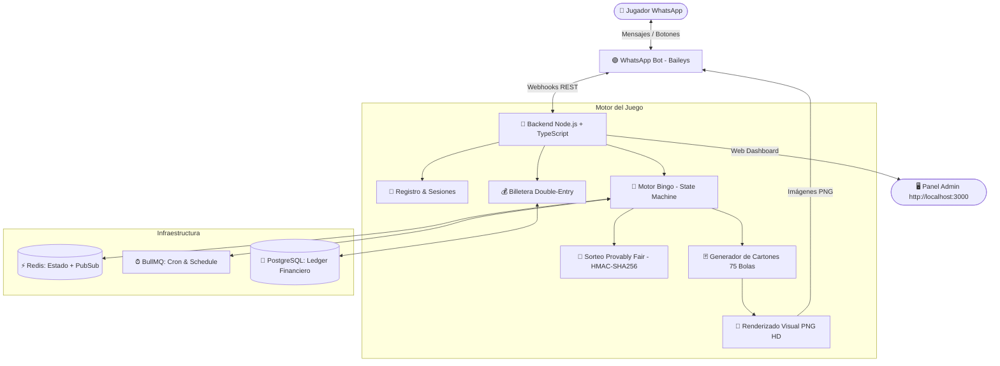

# 🧠 CEREBRO BINGOPRO — Documentación Maestra & Memoria de Sistema

Este archivo contiene el **Cerebro Operativo** completo de **BingoPro**, sirviendo como guía de conocimiento, reglas de negocio, arquitectura de código y referencia para desarrolladores e inteligencia artificial.

---

## 📌 1. Visión General del Proyecto

BingoPro es una plataforma profesional de Bingo online en tiempo real, 100% automatizada a través de WhatsApp, respaldada por un motor financiero de doble entrada (Double-Entry Ledger) e integrada con un Panel de Administración Web con estética de casino oscuro.

### 💰 Parámetros Económicos (Reglas Activas)
- **Precio por Cartón:** `100.00 Bs`
- **Comisión de la Casa (Rake):** `15%`
- **Premio 1 Línea Horizontal:** `10%` del pote total
- **Premio 2 Líneas Horizontales:** `15%` del pote total
- **Premio Bingo Completo:** `60%` del pote total
- **Límite de Cartones:** Hasta `50` cartones por jugador por ronda
- **Intervalo entre Partidas:** Cada `5 minutos` (Automatizado con BullMQ + Redis)
- **Ventana de Venta de Cartones:** `60 segundos`
- **Mínimo de Jugadores:** `2` para iniciar partida (si no se cumple, se reembolsa automáticamente)
- **Método de Recarga:** Pago Móvil (validación manual por Admin)

---

## 📐 2. Arquitectura de Software



---

## 📂 3. Estructura de Directorios

```
BINGO WHATSAPP/
├── CEREBRO.md                 # 🧠 Memoria y guía maestra (este archivo)
├── package.json               # Dependencias de producción
├── tsconfig.json              # Configuración TypeScript (ES2022)
├── docker-compose.yml         # PostgreSQL 16 + Redis 7
├── .env                       # Variables de entorno preconfiguradas
├── prisma/
│   └── schema.prisma          # Esquema DB (Ledger, Partidas, Cartones, Pagos)
├── src/
│   ├── index.ts               # Punto de entrada principal y cableado general
│   ├── config/
│   │   └── env.ts             # Configuración central con validación matemática
│   ├── game/
│   │   ├── engine.ts          # State Machine del bingo (create, sell, draw, finish)
│   │   ├── card-generator.ts  # Algoritmo Fisher-Yates Bingo 75 bolas
│   │   ├── card-renderer.ts   # Renderizador de imágenes PNG HD (@napi-rs/canvas)
│   │   ├── draw-engine.ts     # Sorteo determinístico Provably Fair (HMAC-SHA256)
│   │   ├── win-checker.ts     # Verificador automático de líneas y bingo
│   │   └── scheduler.ts       # Gestor de rondas cada 5 min (BullMQ)
│   ├── wallet/
│   │   ├── ledger.ts          # Contabilidad Double-Entry (débito/crédito atómico)
│   │   └── payout.ts          # Distribución automática de premios
│   ├── whatsapp/
│   │   ├── client.ts          # Cliente Baileys con reconexión y QR
│   │   ├── handlers.ts        # Enrutador de comandos (!comprar, !saldo, etc.)
│   │   └── messages.ts        # Plantillas de mensajes en español
│   ├── admin/
│   │   ├── server.ts          # Servidor API Express
│   │   └── routes.ts          # Endpoints para el Dashboard Web
│   └── utils/
│       ├── crypto.ts          # Hashes SHA-256 y seeds
│       └── logger.ts          # Logs Winston colorizados
└── web-dashboard/             # Dashboard Admin SPA (Dark Theme Glassmorphism)
    ├── index.html
    ├── styles.css
    └── app.js
```

---

## 🔐 4. Sistema Financiero (Double-Entry Ledger)

Para prevenir cualquier descuadre financiero o saldo negativo:

1. **Cuentas del Sistema:**
   - `USER_REAL`: Billetera individual de cada jugador.
   - `HOUSE_ESCROW`: Billetera de custodia donde entran los fondos cobrados por cartones durante una ronda activa.
   - `HOUSE_REVENUE`: Billetera de la casa donde cae la comisión (15%).
   - `PAYMENT_GATEWAY`: Billetera para depósitos y retiros.

2. **Garantía ACID:** Todas las compras de cartones y distribución de premios se ejecutan en transacciones de PostgreSQL (`prisma.$transaction`) con bloqueos a nivel de fila (`FOR UPDATE`).

---

## 🎲 5. Motor Provably Fair (Transparencia Total)

1. Antes de iniciar la compra de cartones, la máquina genera un `serverSeed` (32 bytes aleatorios) y publica su `serverSeedHash = SHA256(serverSeed)`.
2. Al cerrar las ventas, el sistema genera un `clientSeed`.
3. Las 75 bolillas se extraen en una secuencia determinística calculada mediante:
   $$\text{HMAC-SHA256}(\text{serverSeed}, \text{clientSeed})$$
4. Causalidad estricta: Nadie puede predecir ni alterar las bolillas sin modificar el hash que ya fue publicado. Cualquier jugador puede ejecutar `!verificar` para comprobar la legitimidad.

---

## ⚡ 6. Comandos del Bot de WhatsApp

| Comando | Acción |
|---------|--------|
| `!registro` | Registra al usuario en la base de datos |
| `!saldo` | Muestra el balance disponible en Bs |
| `!comprar [N]` | Compra de 1 a 50 cartones para la ronda actual |
| `!cartones` | Envía la imagen PNG de cada cartón del usuario |
| `!recargar` | Entrega los datos de Pago Móvil para recargar |
| `!recargar [monto] [ref]` | Registra reporte de pago para aprobación del Admin |
| `!retirar [monto]` | Registra solicitud de retiro de saldo |
| `!historial` | Muestra las últimas 10 transacciones |
| `!reglas` | Despliega reglas y porcentajes de premios |
| `!verificar` | Muestra la semilla y comprobante de transparencia |

---

## 🖥️ 7. Panel de Administración Web

- **URL:** `http://localhost:3000`
- **Usuario por defecto:** `admin`
- **Contraseña por defecto:** `BingoPro2024!`
- **Funcionalidades:**
  - Estadísticas en vivo (Pote, Usuarios, Partidas, Ingresos Casa)
  - Aprobación/Rechazo de Pago Móvil con acreditación instantánea
  - Procesamiento de solicitudes de retiro
  - Bloqueo/Desbloqueo de usuarios
  - Pausar/Reanudar partidas en vivo

---

## 🚀 8. Guía de Despliegue y Ejecución

```bash
# 1. Posicionarse en el directorio
cd "C:\Users\PABLO\Desktop\BINGO WHATSAPP"

# 2. Iniciar contenedores Docker (DB PostgreSQL + Redis)
docker-compose up -d

# 3. Aplicar esquema a la Base de Datos
npx prisma db push

# 4. Iniciar la aplicación
npm run dev
```

---
*BingoPro — Diseñado y construido con arquitectura de alta disponibilidad, seguridad financiera y experiencia premium.*
